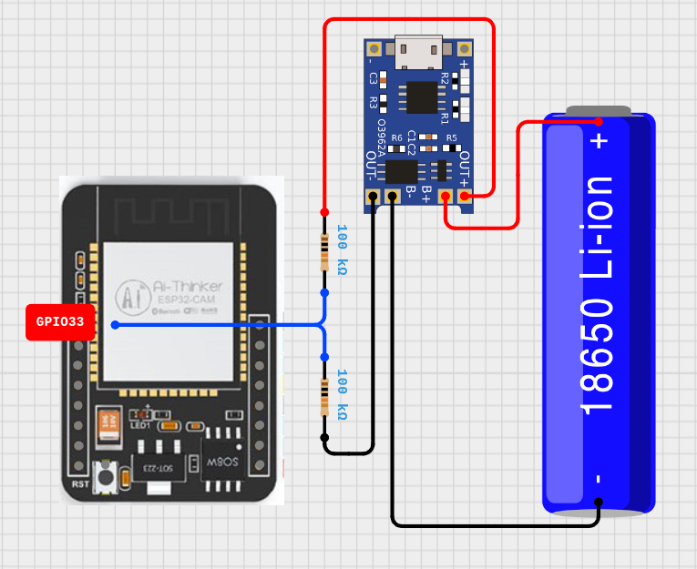

# ESP32-CAM con TelegramBot

Consiste en un sistema de monitores de seguridad basado en un **ESP32-CAM**, que interactúa con un bot de **Telegram**. El dispositivo captura fotos usando la cámara integrada y las envía a los usuarios registrados cuando detecta movimiento mediante un sensor PIR. Además de otras funcionalidades controlables a través de Telegram, como activar o desactivar el **modo de vigilancia**, **tomar fotos** bajo demanda, **transmitir video** en su red local o controlar el **modo de ahorro** de energía. 
- Funciona con una batería 18650 o con alimentación externa pero no es posible usar ambos a la vez.
- Si solo necesita vigilar con detención de movimiento en su red local no es necesario el **sensor (PIR)** puede detectar el movimiento por **software** con [App TinyCam Monitor](
  #-play-store-app-tinycam-monitor) o con [Script Proxy_Video_ESP32.py](#%EF%B8%8F-script-proxy_video_esp32py-linux)

> ⚠️ Al encenderse, la ESP32-CAM intenta cargar las configuraciones almacenadas. Si no encuentra el **token del bot**, las **credenciales Wi-Fi** o al menos **un usuario**, entra en modo configuración usando **WiFiManager** para obtener estos datos para obtenerlos.

<p align="center">
  
</p>

## 🛠️ Configuración del Entorno
### Software
- **IDE:** Arduino `v1.8.x` o `v2.3.x`
- **Framework:** Arduino ESP32 `v3.0.7`
- **Board:** `AI Thinker ESP32-CAM`
- **Partition:** `Regular 4MB with spiffs(1.2MB APP/1.5MB SPIFFS).`</b>    
  En caso de usar la función de **OTA**: `Minimal SPIFFS(1.9 APP with OTA/ 190KB SPIFFS).`

### Librerías

- **WiFiManager** `v2.0.17`: Para gestionar la conexión Wi-Fi.
- **UniversalTelegramBot** `v1.3.0`: Para la integración con el bot de Telegram.
- **ArduinoJson** `v7.4.1`: Para el manejo de JSON en la comunicación con el bot de Telegram.
- **TelnetStream** `v1.3.0`: Usar solo si no dispone de una comunicación serial.

## 🔧 Hardware

- 1x Board ESP32-CAM y antena externa (opcional).
- 1x Sensor de movimiento PIR HC-SR501.
- 1x Step-Up MT3608 DC-DC
- 1x Modulo de carga TP4056.
- 1x Portabateria 18650.
- 1x Bateria 18650.
- 1x Interruptor 6P DPDT.
- 1x Diodo led.
- Resistencias 100 kohm, 10 kohm y 100 ohm.

## 🔌 Diagrama

<p align="center">
  
</p>

---

> ⚠️ Primero verificar que funcione bien la **PSRAM** de la la placa **ESP32-CAM** usando el modelo de placa: **AI Thinker ESP32-CAM** al parecer algunas unidades tienen ese defecto desde fabrica.

```c
#include <Arduino.h>
void setup() {
  Serial.begin(115200);
  delay(1000);

  if (psramFound()) {
    Serial.println("PSRAM está habilitada y funcionando.");
  } else {
    Serial.println("PSRAM no está habilitada o disponible.");
  }
}

void loop() {
}
```

> Si ocurren fallas como `Error al iniciar la camara`, `Error al capturar la foto` o `reinicios por culpa del WDT` recomendacion desactivar la funcion del **Watchdogs**.

## 🖼️ Capturas

<p align="center">
  
  
</p>

<p align="center">
  
  
</p>

## 🌐 Características del Bot de Telegram

| **Comando**                        | **Descripción** |
|-----------------------------------|-----------------|
| `/estado`                         | Muestra el estado del sistema: <ul><li>Hora actual y número de usuarios en vigilancia</li><li>Estado del dispositivo (ON/OFF)</li><li>Modo vigilancia (ON/OFF)</li><li>Modo ahorro de energía (ON/OFF)</li><li>Alerta de duración del movimiento (ON/OFF)</li><li>Apagado automático NOCHES (ON/OFF)</li><li>Alerta de bot lento (ON/OFF)</li><li>Estado del usuario invitado (ON/OFF)</li><li>Temperatura interna *(SENSOR INTERNO NO CONFIABLE)*</li><li>ssid e ip de la red</li><li>Intensidad de la señal WiFi</li><li>Tipo de alimentación (externa o batería)</li></ul> |
| `/VIGILAR` / `/NO-VIGILAR`        | Activa o desactiva el modo vigilancia. Envía foto al detectar movimiento. |
| `/foto`                           | Solicita una foto en cualquier momento. |
| `/APAGAR` / `/ENCENDER`           | Apaga o enciende el dispositivo. Usa *deep sleep* al apagarse. |
| `/modDormido` / `/modDespierto`   | Activa o desactiva el modo ahorro de energía (deep sleep con PIR). |
| `/iniciarVideo` / `/pararVideo`   | Iniciar o detener la transmisión de video a través de su red local: [http://espcam-bot.local](http://espcam-bot.local) --> [VER IMAGEN](imagenes/Screenshot_5.jpg)|
|`estadoInv`                        | Activar o encender el segundo usuario. |
| `/comandos`                       | Muestra comandos adicionales y alerta LED:<ul><li>`/alertDura`: ON/OFF – LED se mantiene encendido con movimiento.</li><li>`/apagAuto`: ON/OFF – Apagado automático nocturno.</li><li>`/updateOTA`: Activar OTA (solo admin).</li><li>`/configDatos`: Reinicia para reconfigurar con WiFiManager (solo admin).</li><li>`/reiniciar`: Reinicia la ESP32-CAM.</li></ul> |

  ```txt
  💡 INFORMACIÓN DEL LED
  - Parpadeo_Rapido: Esta en modo config. de creden.
  - Parpadeo_Normal: Calibrando sensor al iniciar.
  - Un_Parpadeo: Captura una foto.
  - Dos_Parpadeos: Error de acceso a la memoria.
  - Encendido: actualizacion OTA o duracion del mov. detectado (solo si esta activado la opcion).
  ```

- **Alerta de batería**: Notificar si la batería baja por debajo del 15% cuando se esta usando la batería como fuente de alimentacion.
- **Lentitud con el bot**: Cuando esta en modo-vigilar notificar si el bot tarda en verificar la existencia de nuevos mensajes y eso genera un retraso en cada interacción.
- **Sobrecalentamiento**: Notificar cuando el sensor interno de temperatura alcance un umbral definido, (**CABE ACLARAR QUE EL SENSOR INTERNO DE ESTA BOARD NO ES CONFIABLE**) recomendación usar un sensor externo.
> ⚠️ Las mensajes de posible fallo se muestra en los **mensajes de bienvenida** o en el **portal de WifiManager**.

### Calidad de imagen y video
La **calidad de las imagenes** se debe cambiar desde `void configCamara()` **mayor calidad** y **tamaño de imagen** significa mayor consumo electrico y menor rendimiento de la ESP32.

```c
config.frame_size = FRAMESIZE_VGA; // FRAMESIZE_ + QVGA|CIF|VGA|SVGA|XGA|SXGA|UXGA 
config.jpeg_quality = 30;          // 0-63 un número más bajo significa mayor calidad de imagen.
```

Si tiene constante problemas de error al iniciar la cámara, quizás ayude ajustando esta configuración.
```c
config.xclk_freq_hz = 15000000; // default: 20000000 20MHz
```

### Funciones Dev
En caso de realizar modificaciones.

- **Actualización OTA (Over-the-Air):** **(Aunque esta funcion ya biene integrada en WifiManager)**. El proyecto incluye la funcionalidad de actualización OTA, lo que permite cargar nuevo firmware de forma remota a través de la red Wi-Fi. Esto resulta especialmente útil en la ESP32-CAM, ya que este modelo no cuenta con un puerto USB integrado. Esta función simplifica el mantenimiento sin necesidad de acceso físico al dispositivo.

- **Depuración Remota con TelnetStream:** Incorpora la librería TelnetStream, que permite realizar la depuración del dispositivo de forma remota mediante una conexión Telnet a traves de la red Wi-Fi. Esto resulta especialmente útil para analizar el comportamiento del dispositivo en tiempo real sin necesidad de una conexión física al puerto serial, ideal si se requiere realizar mejoras.

## 📄Flujo de Operaciones

1. **Encendido y Carga de Configuración**: Al encenderse, el dispositivo carga la configuración desde la memoria flash. Si los datos no están disponibles (`token del bot`, `credenciales Wi-Fi`, o `usuario registrado`), entra en **modo configuración** **`(AP mode)`** usando **WiFiManager** para recopilar la información.

2. **Interacción con el Bot**: Una vez configurado, el bot de Telegram interactúa con el dispositivo a través de los comandos definidos. Cada comando tiene una acción específica, como cambiar el modo de vigilancia, tomar fotos o modificar configuraciones de ahorro de energía.
3. **Eventos**: Si hubo un reinicio inesperado informar las causa o de algun otro problema referido a los datos de inicio.
4. **Notificaciones**: El sistema envía notificaciones a los usuarios registrados en caso de que la batería baje por debajo del 15%, sobre calentamiento y cuando el sensor PIR detecta movimiento.

## 🖥️ Script `Proxy_Video_ESP32.py` (linux)
<p align="center"></p>

Este script es un servidor proxy en Flask para retransmitir el video de la ESP32-CAM a través de una interfaz web personalizado lo cual permite ver el video en `Picture-in-Picture (PiP)`, `Pantalla completa`, `Capturar imagen` y `Grabar video`. Si no requiere estas funciones simplemente ingrese a: [http://espcam-bot.local](http://espcam-bot.local) o a la IP de la esp32-cam. 
1. **Instalar Python**:
   Asegúrate de tener `Python 3.10` o superior instalado en tu sistema. Puedes descargarlo desde [python.org](https://www.python.org/).

2. **Instalar las dependencias**:
   Ejecuta el siguiente comando para instalar las librerías necesarias, flask `v3.1.x` y ffmpeg `v4.4.x` para el video:
   ```bash
   sudo apt install ffmpeg
   pip install flask pillow requests imagehash plyer

   ```

3. **Ejecutar el script**:
   Inicia el servidor ejecutando el script:
   ```bash
   python3 Proxy_Video_ESP32.py

   ```
4. **Acceder al servidor**:
   - Para acceder, abre [http://localhost:5001](http://localhost:5001) en tu navegador.

## 📱 Play Store app: `TinyCam Monitor`
[TinyCam Monitor](https://play.google.com/store/apps/details?id=com.alexvas.dvr) funciona excelente si requiere las funciones: `Picture-in-Picture (PiP)`, `Pantalla completa`, `Capturar imagen` y `Grabar video` y ademas contiene funciones de detención de `movimiento`, `personas`, `mascotas` y `vehiculos` pero estos últimos solo disponible en la **version premium**.
Contiene notificaciones de eventos a través de `correo` y `telegram`.

<p align="center">
  
  
</p>

### Configuración
- **Fabricante de camara**: `(Generic)`
- **Modelo de camara**: `Generic URL`
- **Peticion JPEG/MJPEG/RTSP**: `http://espcam-bot.local/video`
- **Protocolo**: `Snapshot (JPEG)`

## 💡 Consideraciones

- Tener una conexión Wi-Fi estable para interactuar con el bot de Telegram.
- El modo **deep sleep** es útil cuando se utiliza la batería para prolongar la duracion de la batería pero desde la detencion del movimiento hast que sea enviado hay un retraso mas largo de milisegundos que al no usar el modo deep sleep.


## ⚡ Alternar entre fuente externa y bateria

Circuito para conmutar la alimentacion entre la bateria y una fuente externa 5V. [VER IMAGEN](imagenes/Conmutacion.jpg)

> ⚠️ Si el dispositivo está conectado a una fuente de alimentación externa, se recomienda no utilizar la batería simultáneamente. El modulo TP4056 no esta diseñado para cargar la bateria y alimentar el dispositivo al mismo tiempo, lo que podría provocar sobrecargas y ser peligroso. Usa la batería únicamente cuando no dispongas de una fuente externa. 

- [Añadir cargador de batería a ESP8266 y ESP32](https://emariete.com/cargador-bateria-esp8266-esp32-bien-hecho/)


## 🔋 Nivel de la bateria
### ⚠️ Uso de GPIO33 para medir el nivel de batería en ESP32-CAM

En la placa ESP32-CAM, solo los pines ADC2 están disponibles externamente. Sin embargo, los pines ADC2 son utilizados internamente por el controlador Wi-Fi o por la microSD, por lo que **no pueden ser usados para lecturas analógicas mientras el Wi-Fi está habilitado**.

Por defecto, el pin **GPIO33** que es ADC1 está conectado al LED integrado de la placa. Para utilizar este pin como entrada analógica para medir el nivel de la batería, **se debe desoldar el LED integrado** que está conectado a GPIO33. De esta forma, podrás conectar el divisor resistivo para la medición de voltaje de la batería a este pin.
<p align="center">
  
</p>

- [Battery Status Monitoring System using ESP8266 & Arduino IoT Cloud](https://iotprojectsideas.com/battery-status-monitoring-system-using-esp8266-arduino-iot-cloud/)
- [ESP8266 Monitor its Own Battery Level using IoT](https://iotprojectsideas.com/esp8266-monitor-its-own-battery-level-using-iot/)
- [IoT Based Battery Status Monitoring System using ESP8266](https://how2electronics.com/iot-based-battery-status-monitoring-system-using-esp8266/)
